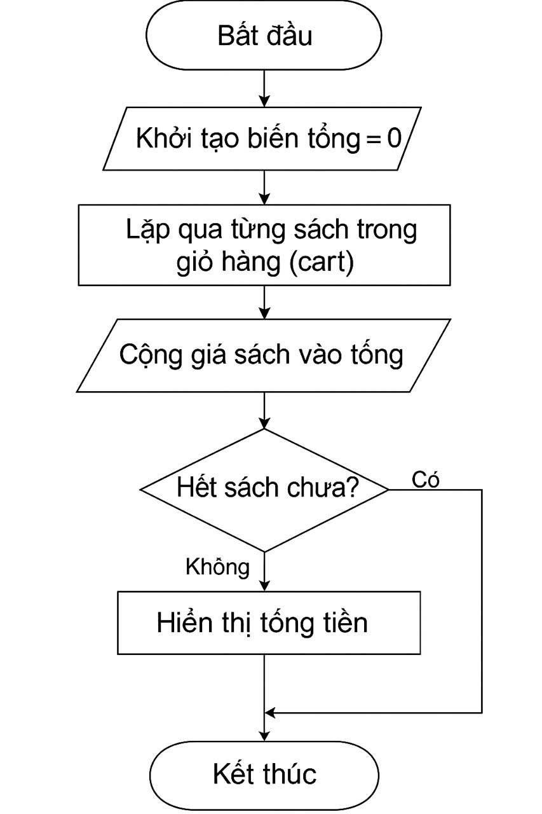
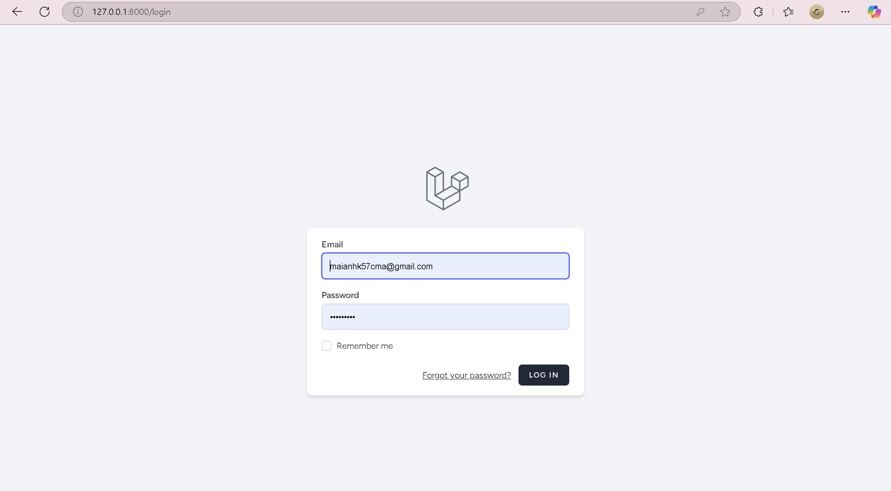
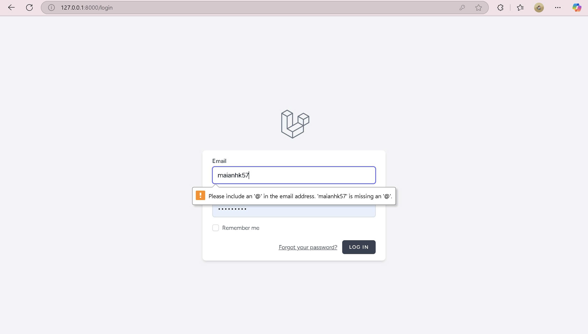
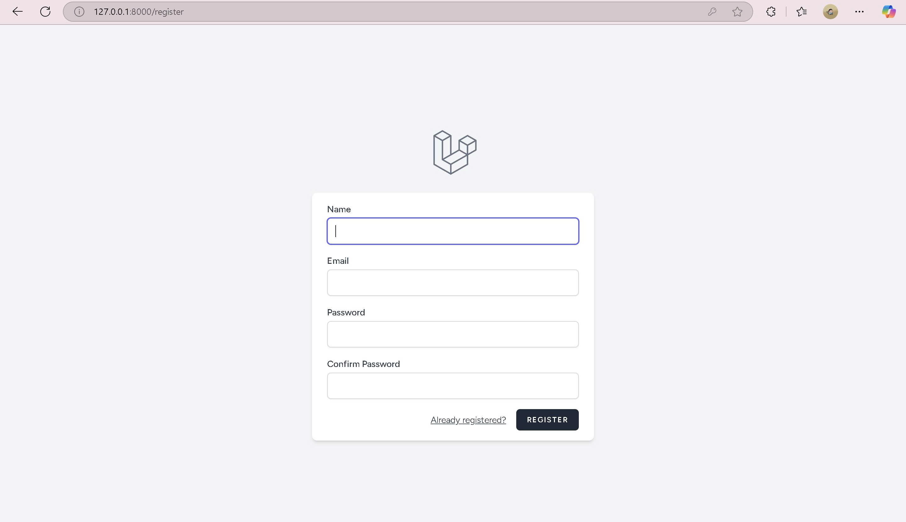
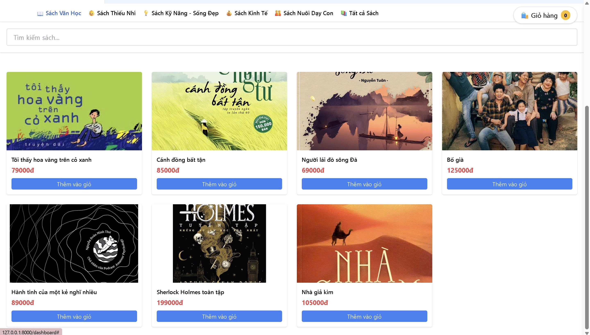
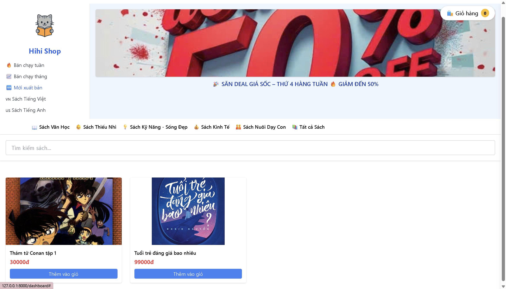
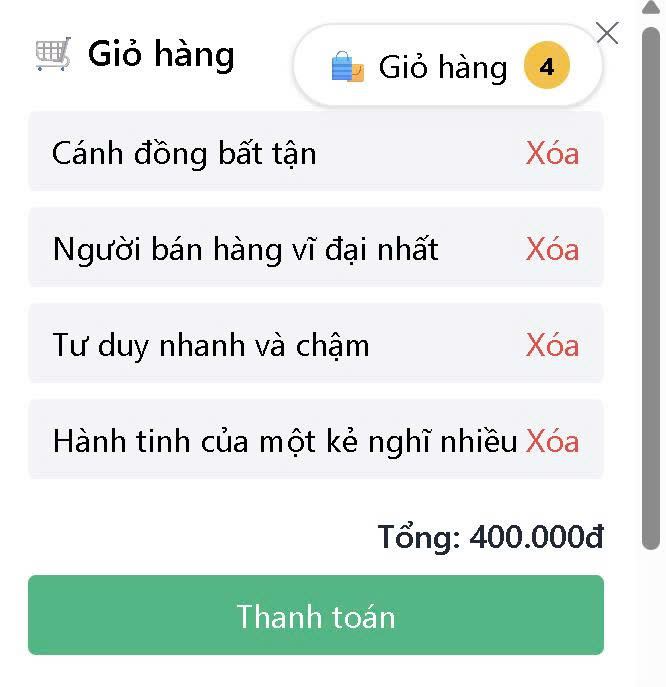

# 📚 Project Laravel Bookstore

>  Dự án này xây dựng một ứng dụng web quản lý bán sách sử dụng Laravel – framework PHP hiện đại, mạnh mẽ và phổ biến.
> Ứng dụng mô phỏng quy trình đặt hàng, quản lý sách và người dùng.
> Hệ thống được thiết kế đầy đủ các chức năng xác thực, CRUD, xử lý đơn hàng, đảm bảo bảo mật và trải nghiệm người dùng rõ ràng.

>  Sử dụng Breeze cho xác thực, Eloquent cho thao tác DB và Blade để xây dựng giao diện.  
---

## 👩‍🎓 Thông tin sinh viên

- **Họ và tên:** Nguyễn Mai Anh  
- **Mã sinh viên:** 23010490  
- **Link repo:** https://github.com/MaiAnhne/webProject.git
---

## Sơ đồ cấu trúc

## Sơ đồ thuật toán tính tổng tiền trong giỏ hàng

## Chức năng chính
###  Hoàn thành

- [x] CRUD order: thêm / xoá 
- [x] Đăng ký / đăng nhập bằng Laravel Breeze
- [x] Điều hướng các danh mục sách 
- [x] Đặt đơn hàng với nhiều sách 
- [x] Tính tổng tiền đơn hàng 
- [x] Danh sách đơn hàng người dùng đã tạo
- [x] Responsive
- [x] Bảo mật (CSRF, XSS, Auth, Validation...)

**Demo**
## Trang đăng nhập
   
   
   

## Giao diện điều hướng
- Khi bấm vào mục sách văn học sẽ lọc ra những sách thuộc lĩnh vực văn học
   
- Khi bấm vào mục mới xuất bản sẽ lọc ra những sách như vậy
   

## Giỏ hàng
   

###  Chưa hoàn thành (có thể làm thêm)
- [ ] Tích hợp thanh toán online (VNPay, Momo,...)
- [ ] Gửi mail xác nhận khi đặt đơn

## 🛠️ Công nghệ sử dụng

| Công cụ         | Mô tả                                   |
|----------------|------------------------------------------|
| **Laravel** | Framework PHP mạnh mẽ, phổ biến             |
| **Laravel Breeze** | Gói xác thực user đơn giản, nhẹ      |
| **Tailwind CSS** | Dùng để viết giao diện đẹp, gọn        |
| **Eloquent ORM** | Quản lý quan hệ bảng dễ như chơi       |
| **GitHub Codespaces** | Viết Laravel ngay trên web        |

## Bảo mật được áp dụng
- CSRF	Mọi form có @csrf
- XSS	Escape dữ liệu {{ $var }}
- SQL Injection	Dùng Eloquent, không viết query thủ công
- Auth	Route dùng middleware auth
- Validation	Sử dụng $request->validate()
- Session	Laravel quản lý session mặc định

## Code chính
### Model Order
